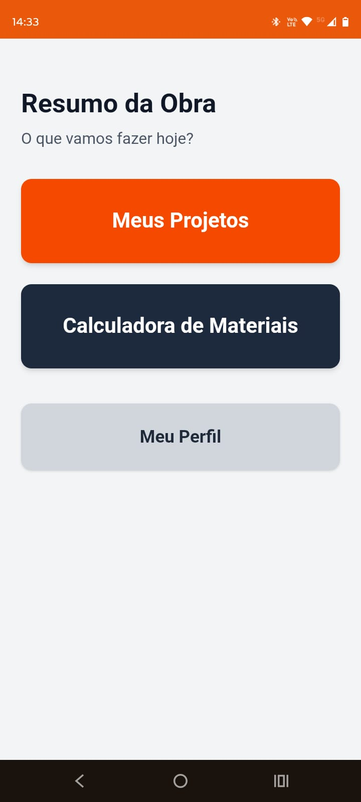
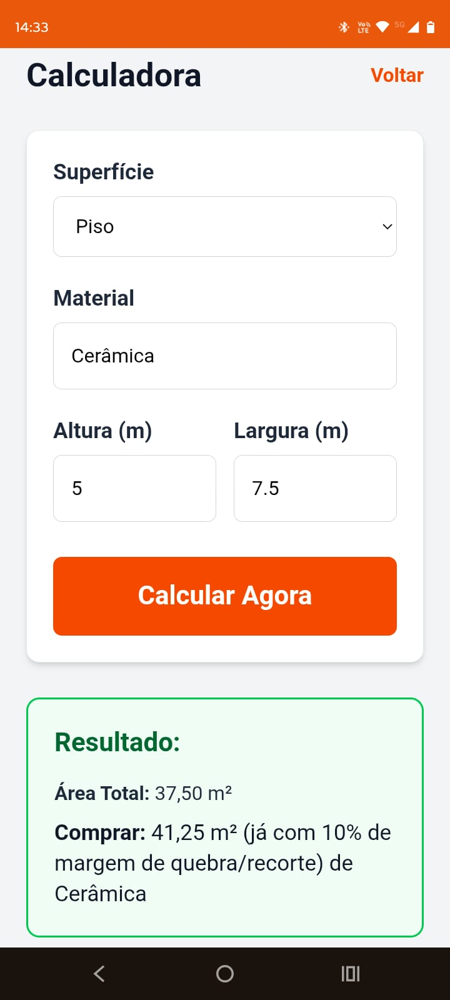
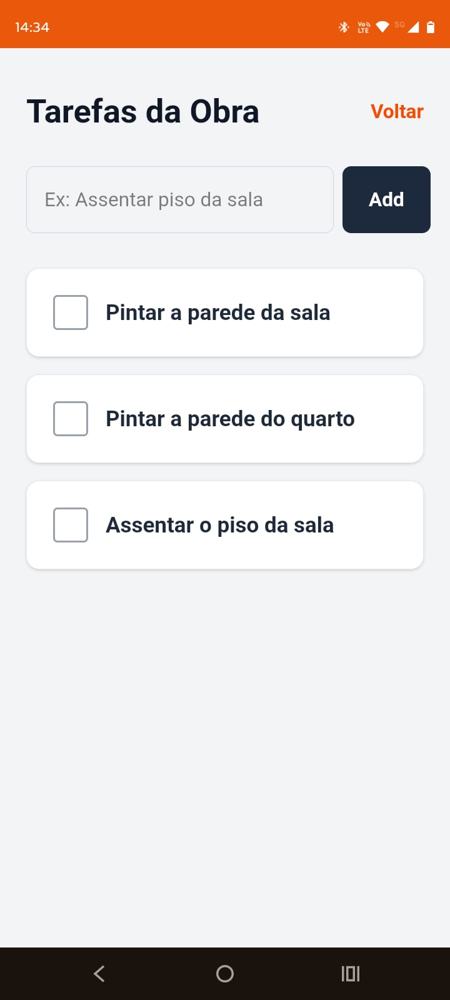

# 🏗️ Obra Certa - Gestão Simplificada de Obras

O **Obra Certa** é um Progressive Web App (PWA) projetado para resolver a gestão de tarefas e automatizar o cálculo de materiais diretamente no canteiro de obras, focando em alta acessibilidade visual e usabilidade mobile.

## 📱 Telas do Sistema

  
  &nbsp;&nbsp;&nbsp;
  
  &nbsp;&nbsp;&nbsp;
  

## 🚀 Evolução da Arquitetura e Contexto

Nascido durante o curso de Análise e Desenvolvimento de Sistemas da FATEC Ferraz, o sistema foi concebido inicialmente com uma API robusta em Java (Spring Boot), com foco em isolamento **Multi-Tenant** e utilização de **Java Records** para a transferência segura de dados (DTOs).

Visando otimizar a experiência no campo, um ambiente onde a conexão de rede oscila e o profissional (pedreiro, mestre de obras) precisa de uma interface tátil e imediata, a arquitetura evoluiu para um ecossistema Serverless. A migração para Next.js integrado ao Supabase reduziu a latência de rede, eliminou gargalos clássicos de infraestrutura (como bloqueios de CORS) e permitiu empacotar o sistema como um aplicativo nativo (PWA).

## 🛠️ Tecnologias Utilizadas

  

 

* **Frontend & PWA:** Next.js 16 (App Router), React, Tailwind CSS.
* **Backend as a Service (BaaS):** Supabase (PostgreSQL, Authentication).
* **Segurança:** Row Level Security (RLS) aplicada diretamente nas tabelas.
* **Deploy:** Vercel (CI/CD nativo e automático).

## ✨ Funcionalidades Principais

* **PWA Instalável:** O sistema pode ser adicionado à tela inicial do smartphone, comportando-se como um aplicativo nativo sem a necessidade de distribuição via Play Store/App Store.
* **Calculadora de Materiais Engine:** Lógica de negócios executada no lado do cliente (Client-Side) para cálculo instantâneo de pisos, forros e paredes, incluindo margens operacionais padrão da construção civil (ex: **10%** de quebra).
* **Gestão de Obras (CRUD):** Criação de projetos independentes e checklist de execução de tarefas em tempo real.
* **Autenticação Segura:** Fluxo de login blindado gerenciado pelos provedores do Supabase Auth.

---
> "Tecnologia acessível construída para quem constrói."
